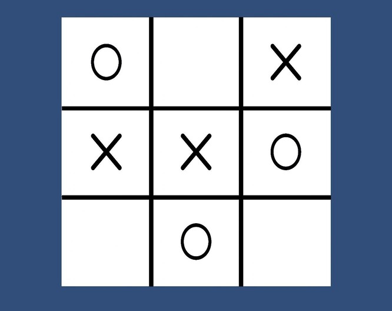

# Unity-TicTacToe-AI-minimax
This repository is about a Unity project of the game Tic Tac Toe, where you can play against an AI implemented with Minimax Algorithm.
Here you can find the game already built (for Windows only) and the Unity project.

## Requirements

If you only want to run the application and play:
 - Windows 64bit

If you want to open, edit or see the Unity project:
 - Unity 2020.1.1f1 (or greater)
 - You can use Unity versions before the 2020.1.1f1 but errors may will occur

## Get the Unity project

Download the project and open it using Unity Hub with the recommended Unity version **2020.1.1f1** (or greater)

## Run the app

In order to only play the game, you can download the project and go to: **TIC_TAC_TOE_AI > Builds** and run the application: **TIC_TAC_TOE_AI.exe**

Eventually if you opened it with Unity, you can directly test it in the Unity Editor or you can build it yourself.

## How to play

The rules of Tic Tac Toe are described here: [`Rules`][rules-link].

[rules-link]: https://en.wikipedia.org/wiki/Tic-tac-toe

You have the first move so, when the game starts, click on one of the squares of the board to sign it with an "**O**" mark. Soon after the AI will reply to your move with the "**X**" mark.
When the game is over, you can press the button "Try Again" to start a new game.

Press ALT+F4 to exit the game.
