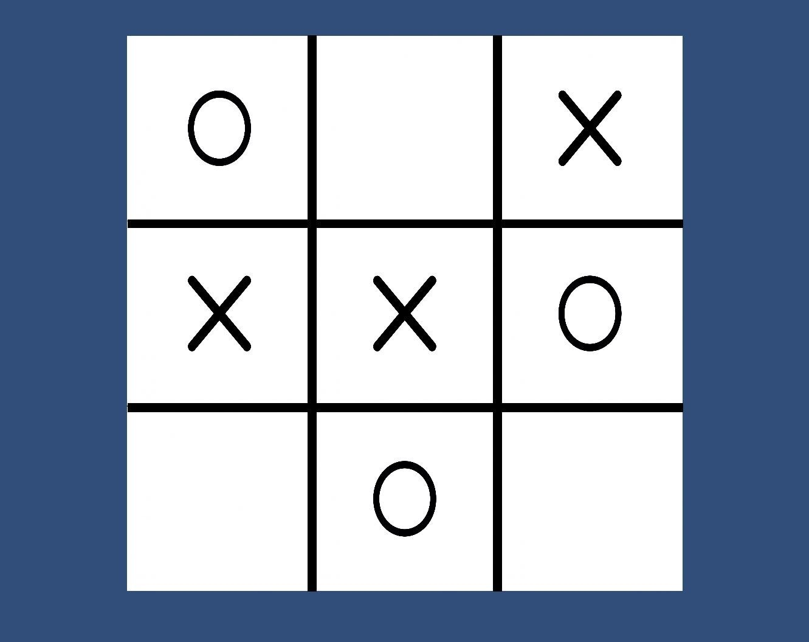

# Unity-TicTacToe-AI-minimax
This repository is about a Unity project of the game Tic Tac Toe, where you can play against an AI implemented with Minimax Algorithm.
Here you can find the game already built (for Windows only) and the Unity project.

## Requirements
